# Lab 2 CSS DASAR THML

1. Menapilan Header, Vanbar div Class, ID
* Membuat tampilan Header di dalam tampilan body dengan menggunakan tag `<Header> </Header>` lalu masukan tag `<h1>` menampilan isi dalam `<h1> CSS Internal dan <i>Inline CSS</i></h1>`, tag `<i>` untuk menampilak text miring.

* langkah selanjutya membuat tampilan navbar dengan tag `<nav>`, di dalam tag nav masukan link dengan tag ``, isi bagian `href` dengan link yang akan di tuju lalu masukan isi text yang akan di tampilkan pada web agar penguna mengetahui link tersebut menuju pada bagian mana, contoh seperti pada gambar di bawah ini.
* Membuat CSS ID Selector pada bagian ini buat lah sebuah `
` isi pada bagian kutip dua degan `intro` untuk menandai bawah di dalam div mempunyai ID yang di wakilkan seluruh isi dalam div itu dengan Intro
* Membuat CSS Class   membuat Class Selector, masukan nama `Class=""` lalu isi link pada bagian `href=""` contoh seperti di bawah ini. 
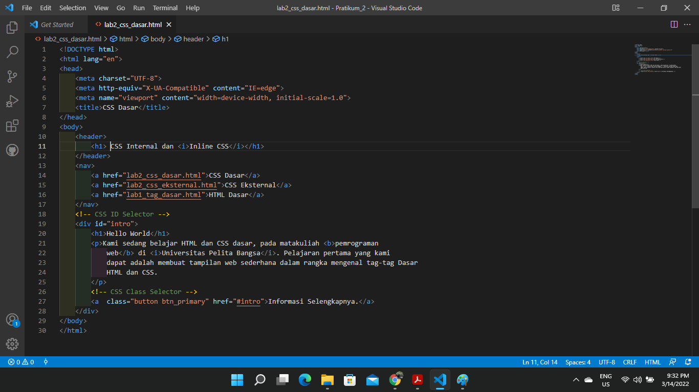
* Maka Tampilan akan seperti di bawah ini

2. Mendeklarasikan CSS Internal
* pada bagian  `<head>` tulis tag `
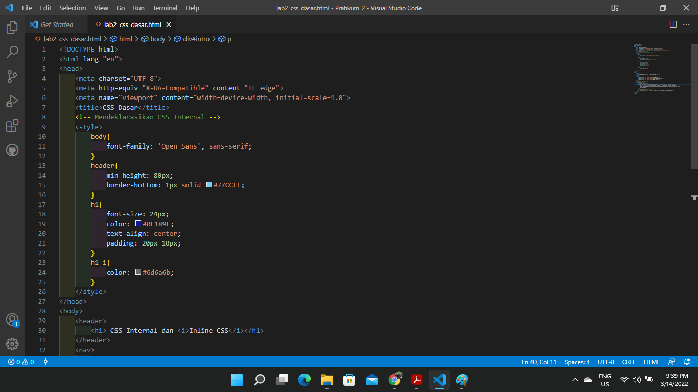
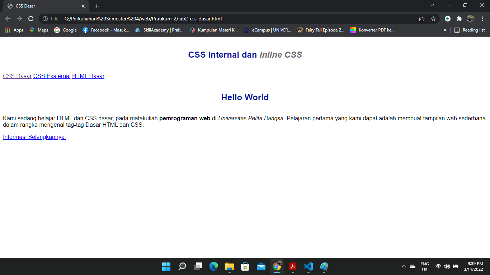

3. 
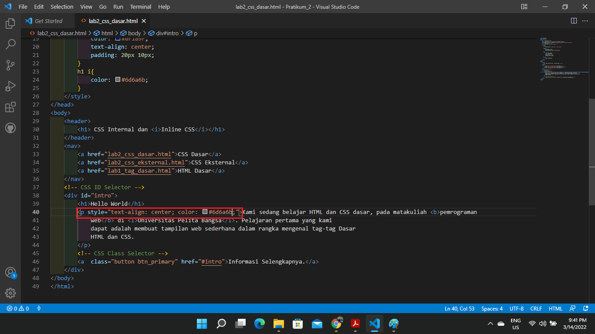
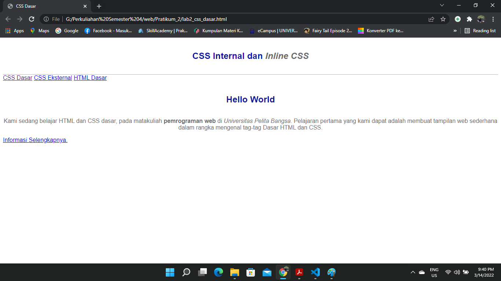

4. 
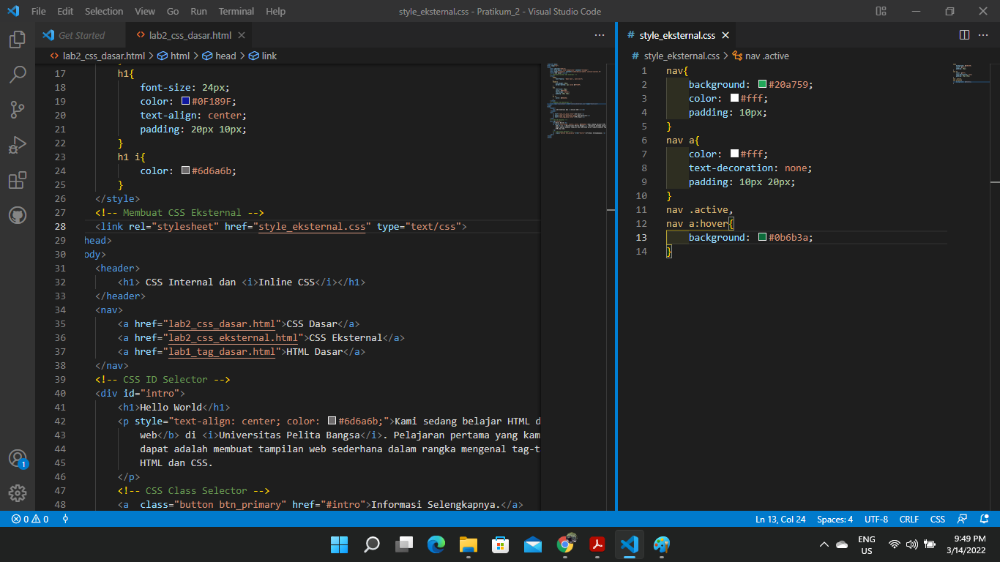
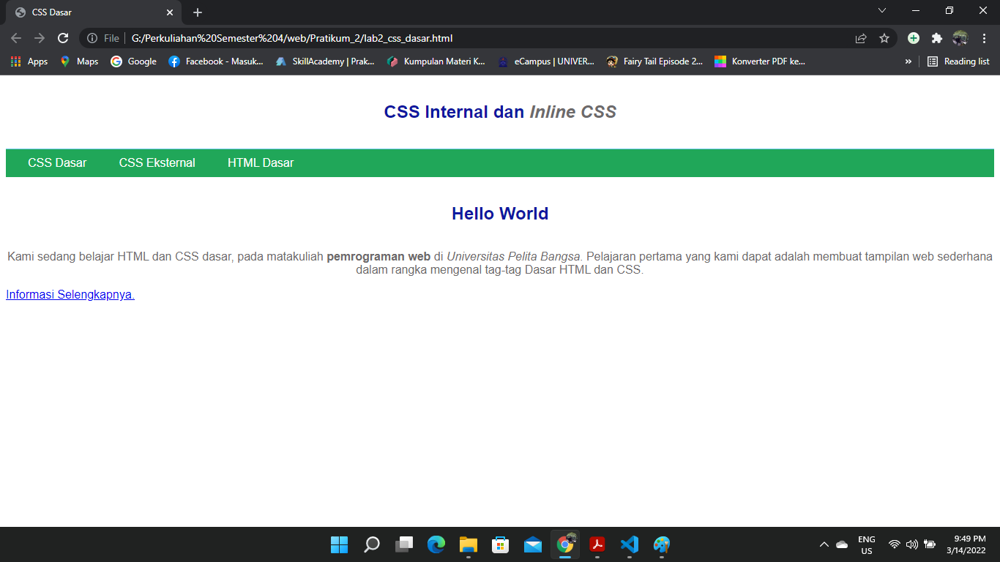

5. 
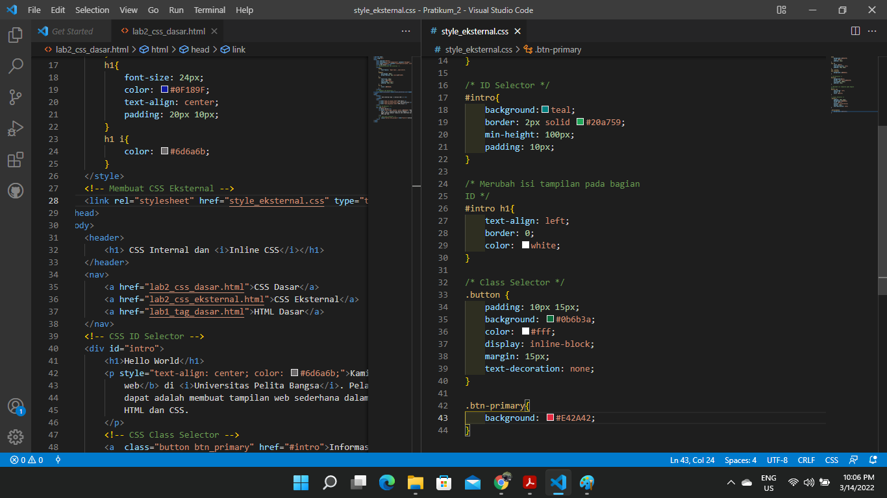
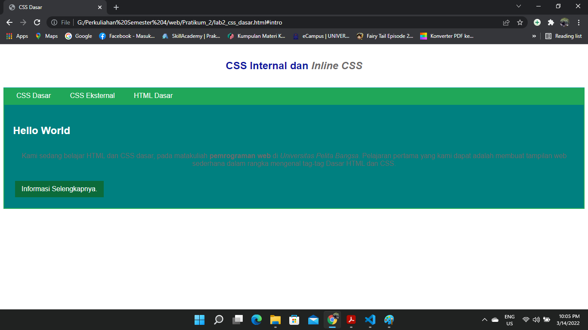

6. 
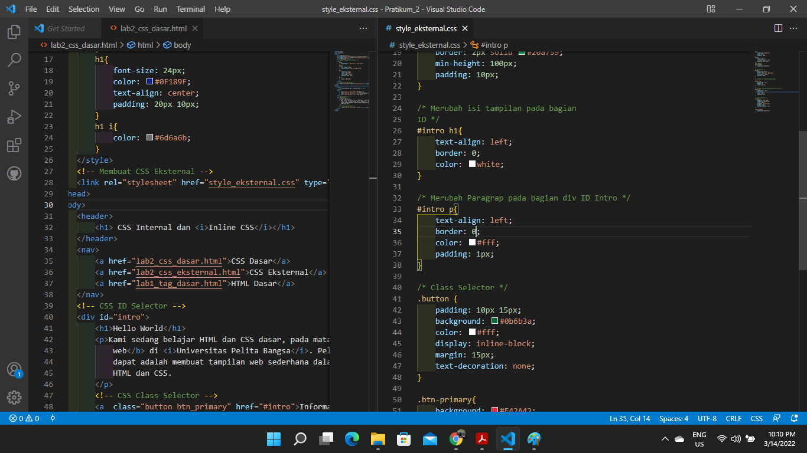
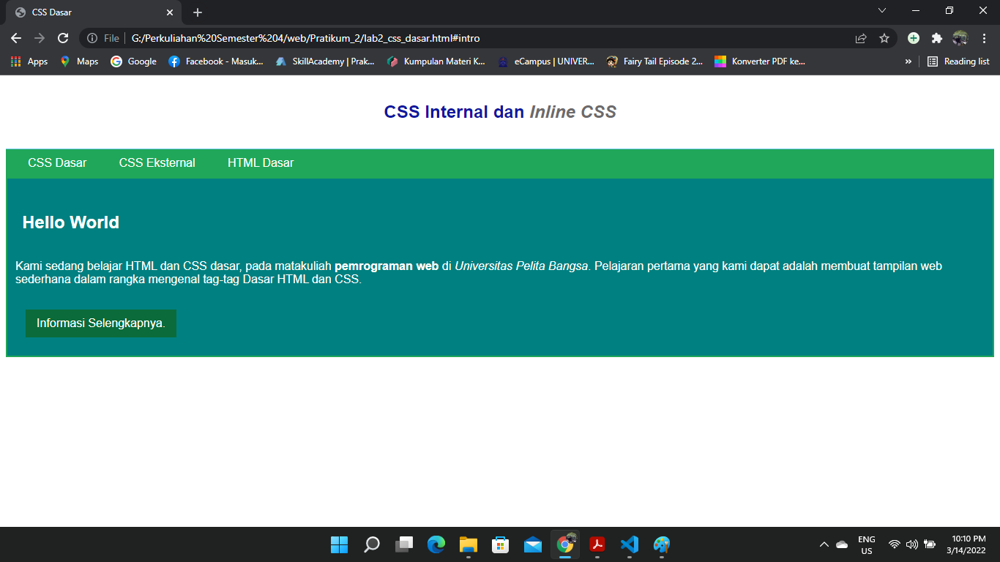

7. 
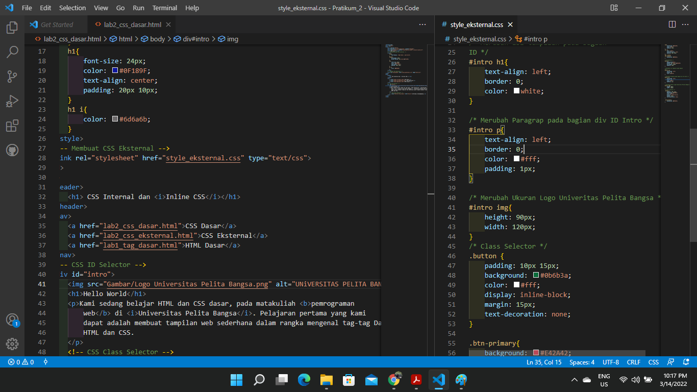
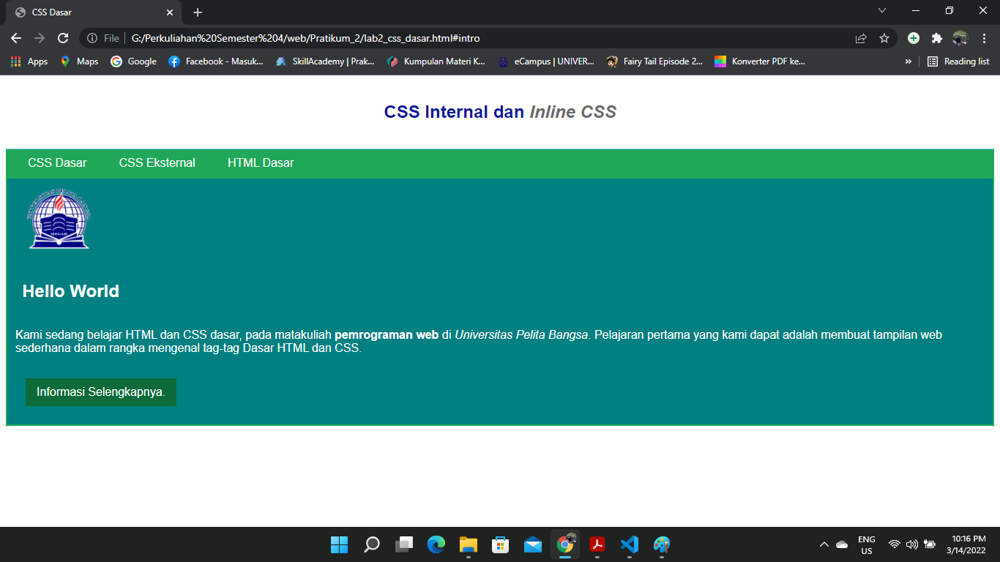

## Pertanyaan dan Tugas
1. Lakukan eksperimen dengan mengubah dan menambah properti dan nilai pada kode CSS dengan mengacu pada CSS Cheat Sheet yang diberikan pada file terpisah dari modul ini.
2. Apa perbedaan pendeklarasian CSS elemen h1 {...} dengan #intro h1 {...}? berikan penjelasannya!
3. Apabila ada deklarasi CSS secara internal, lalu ditambahkan CSS eksternal dan inline CSS pada elemen yang sama. Deklarasi manakah yang akan ditampilkan pada browser? Berikan penjelasan dan contohnya!
4. Pada sebuah elemen HTML terdapat ID dan Class, apabila masing-masing selector tersebut terdapat deklarasi CSS, maka deklarasi manakah yang akan ditampilkan pada browser? Berikan penjelasan dan contohnya! `( 
 )`